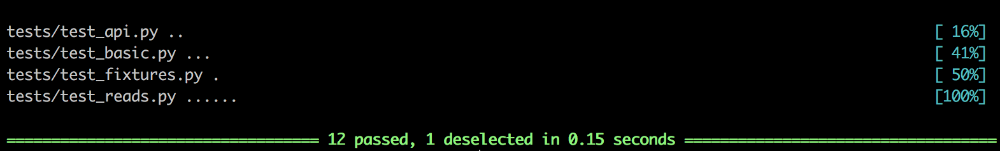

# PyTest
 Reference package for a variety of unit test cases
 

 
## Why does this exist?
I collected these examples from all the unit tests I've written over the past year+ writing data science code. I found myself frequently scanning through codebases chasing a certain test pattern I knew I'd figured out before, so I gathered them here for easy reference. It also serves as an example of how to set up folders/imports/etc. for pytest.
 
Unlike most packages, the core of this repo is under `tests/`. The functions in `pytest_examples` exist purely to serve as minimal working examples of patterns I want to test.

## Usage
Everything in this package is fully runnable, so you can clone or fork the repo and play around. In and of itself the code here does not do anything particularly interesting, but serves as a reference for quickly remembering/learning how to execute certain patterns in unit testing.

## References
Testing tools used in these examples:

[pytest](https://docs.pytest.org/en/latest/)  
[mock](https://docs.python.org/3/library/unittest.mock.html)  
[responses](https://github.com/getsentry/responses)  

If you're new to unit testing or want to learn more about mocking in particular, I've collected a list of blog posts and other reading I've found useful at (bitly.com/pytest_reading).
